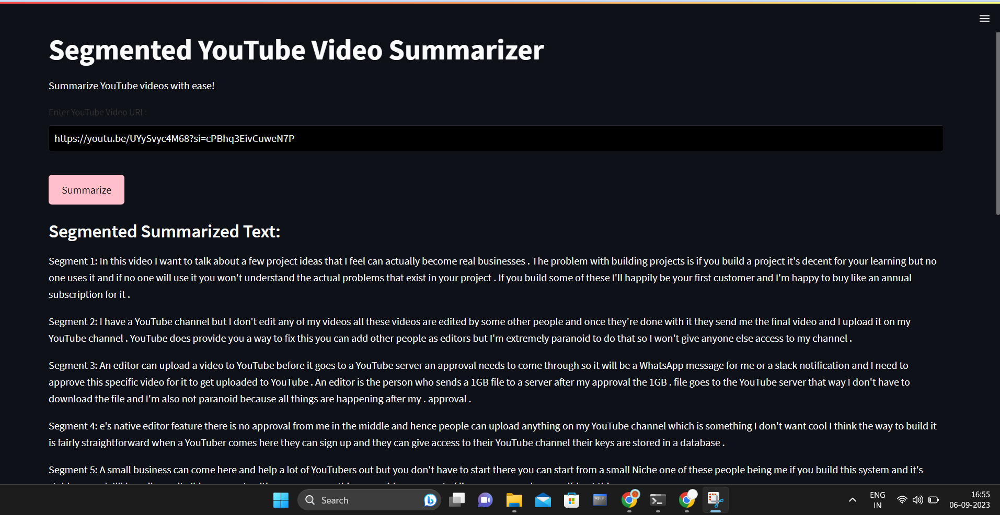

# youtube_video_summarizer

This is a Streamlit web application that allows you to summarize the transcript of a YouTube video. The app fetches the video's transcript, segments it into smaller parts, and summarizes each segment using a natural language processing model. Here's how the app works and what you need to know:

## How to Use

1. **Enter YouTube Video URL**: In the input box, paste the URL of the YouTube video you want to summarize.

2. **Click Summarize**: Click the "Summarize" button to start the summarization process.

3. **View Summarized Text**: The app will process the video transcript and display the summarized text in segments.

## Technologies Used

### Streamlit

[Streamlit](https://streamlit.io/) is the framework used to create the web application. It simplifies the process of turning data scripts into shareable web apps.

### YouTube Transcript API

The app uses the [YouTube Transcript API](https://pypi.org/project/youtube-transcript-api/) to fetch the transcript of the YouTube video based on the provided URL. This API allows access to the video's subtitle data.

### URL Parsing

The app utilizes Python's `urlparse` and `parse_qs` functions to extract the video ID from the YouTube video URL. This helps in identifying the specific video for transcript retrieval.

### Hugging Face Transformers

[Hugging Face Transformers](https://huggingface.co/transformers/) is a library for natural language processing. It is used to perform text summarization on the video transcript segments.

### Python

The app is built using Python, a popular programming language for web applications and data processing.

## Optimization

The code has been optimized for faster processing. It fetches the video transcript, segments it into larger chunks, processes segments in parallel using concurrent futures, and uses caching to reduce processing time.

## Deployment

To deploy this app, you can create a GitHub repository and host it using GitHub Pages. Optionally, you can set up GitHub Actions for automatic deployments.

Follow these steps to deploy the app:
1. Clone the GitHub repository.
2. Add your Streamlit app code to the repository.
3. Commit and push your changes.
4. Configure GitHub Actions or GitHub Pages for deployment.

## Sample Output

Here are some sample output images from the web app:

## License

This project is open-source and available under the [MIT License](LICENSE).

Feel free to use and modify this app for your own projects.
